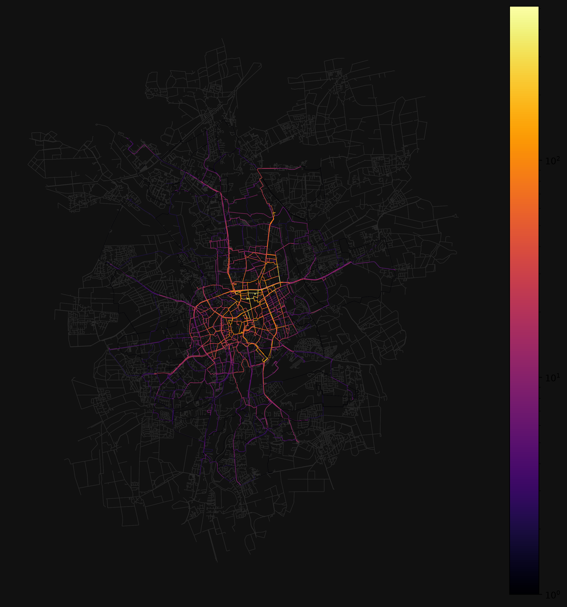
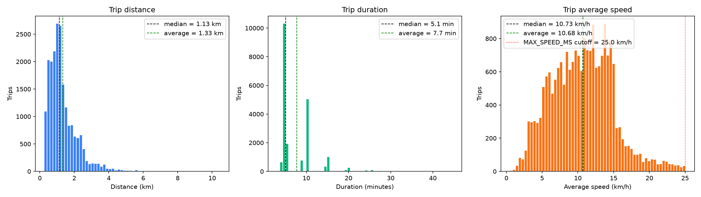

# veloleo

veloleo is the [NextBike](https://www.nextbike.de/de/) provider in Braunschweig, Lower Saxony, Germany.
The python module expects data from a GBFS compliant data converted into single csvs per day in a given folder. Data is harvested by a __private__ module which is referenced as git submodule herein.
Data is processed using event determination based on vanished `bike_ids` and `min_weight_full_bipartite_matching` to determine trips from point data. This is than converted into GeoJSON, GeoPkg and image data.

